# Vim  prepackaged colorscheme &#x1F535; &#x1F534; &#x1F49A; &#x1F49C;.
#### Vim comes with 16 prepackaged colorscheme which is well in **_Vi IMproved 7.4_** since I'm using this version. You can hook with this colorscheme simply use 
```:colorscheme <colorname> ```

### List of colorscheme
- darkblue
- default
- delek
- desert 
- elflord
- evening
- industry 
- koehler
- morning
- murhpy
- pablo
- peachpuff
- ron
- shine
- slate
- torte 
- zellner 

# colorscheme preview 

## blue ```:colorscheme blue```
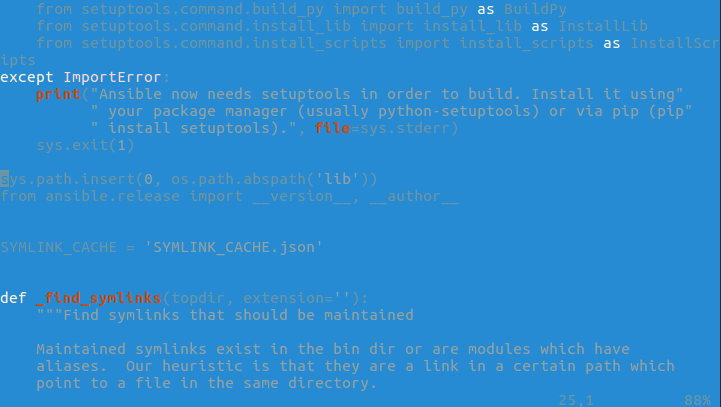

## darkblue ```:colorscheme darkblue```
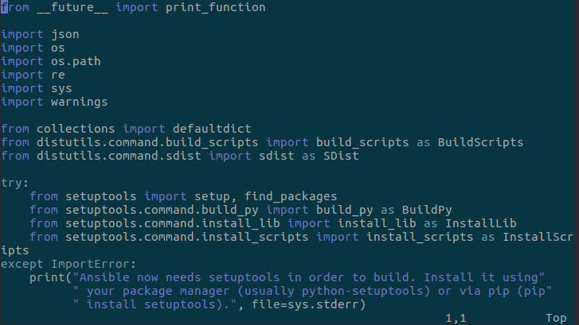

## default ```:colorscheme default```
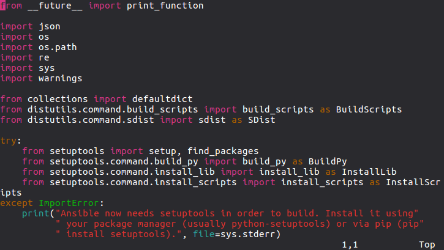

## delek ```:colorscheme delek```
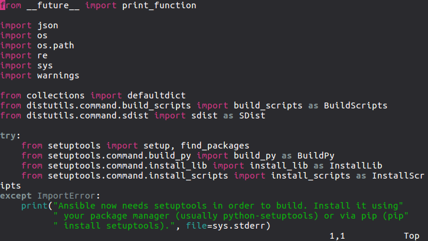

## desert ```:colorscheme desert```
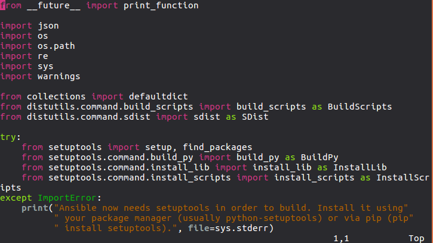

## elflord ```:colorscheme elflord```
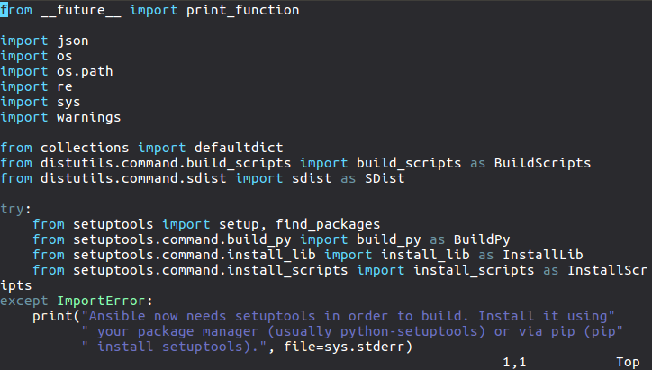

## evening ```:colorscheme evening```
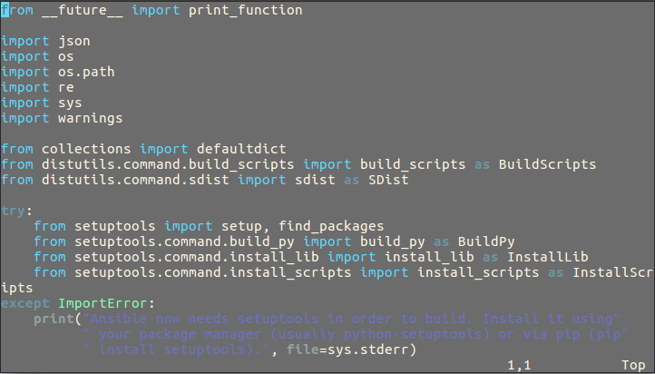

## industry ```:colorscheme industry```
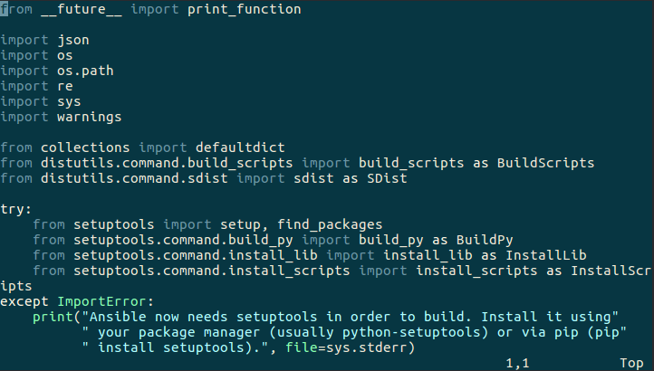

## koehler ```:colorscheme desert```
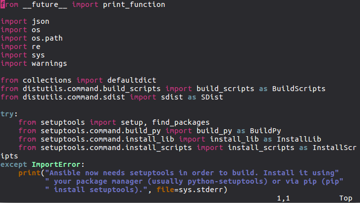

## morning ```:colorscheme morning```
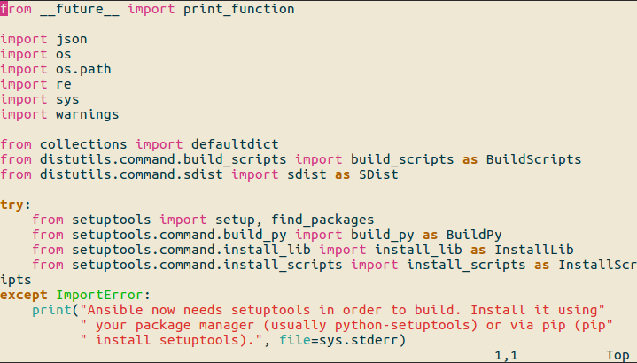

## murhpy ```:colorscheme murhpy```
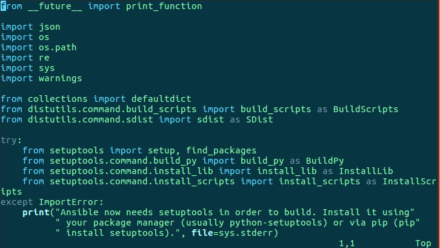

## pablo ```:colorscheme pablo```
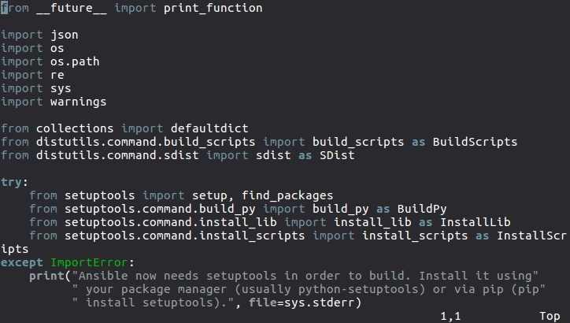

## peachpuff ```:colorscheme peachpuff```


## ron ```:colorscheme ron```
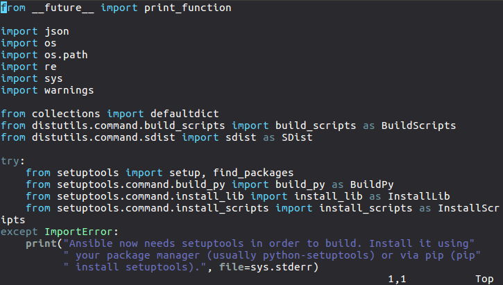

## shine ```:colorscheme shine```
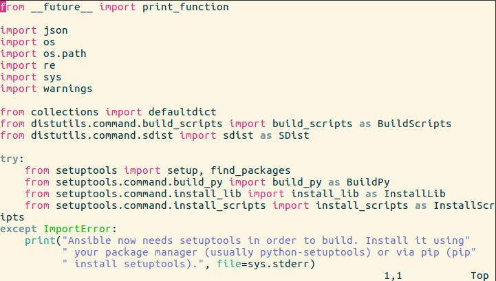

## slate ```:colorscheme slate```
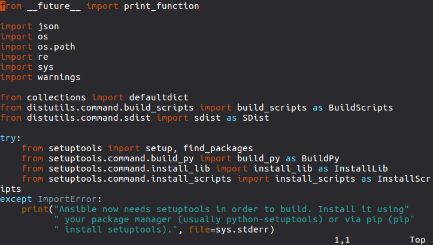

## torte ```:colorscheme torte```
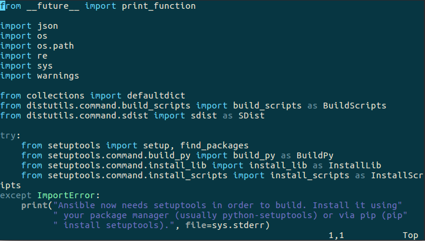

## zellner ```:colorscheme zellner```
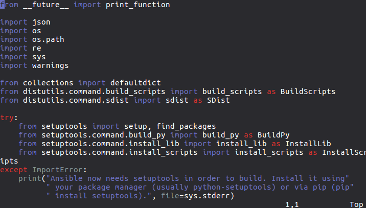

