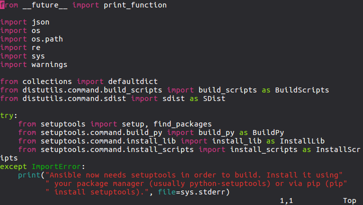

# Vim  prepackaged colorscheme &#x1F535; &#x1F534; &#x1F49A; &#x1F49C;.
Vim comes with 16 prepackaged colorscheme which is well in **_Vi IMproved 7.4_** since I'm using this version. You can hook with this colorscheme simply use 
> ```:colorscheme <colorname> ```
  
> Permanent to vim workspace edit the .vimrc
> >```color <colorname>```

### List of colorscheme ```<colorname>```
- darkblue
- default
- delek
- desert 
- elflord
- evening
- industry 
- koehler
- morning
- murhpy
- pablo
- peachpuff
- ron
- shine
- slate
- torte 
- zellner 

# colorscheme preview 

- ## blue ```:colorscheme blue``` and .vimrc -> ```color blue```


- ## darkblue ```:colorscheme darkblue``` and .vimrc -> ```color darkblue```


- ## default ```:colorscheme default``` and .vimrc -> ```color default```


- ## delek ```:colorscheme delek``` and .vimrc -> ```color delek```


- ## desert ```:colorscheme desert``` and .vimrc -> ```color desert```


- ## elflord ```:colorscheme elflord``` and .vimrc -> ```color elflord```


- ## evening ```:colorscheme evening``` and .vimrc -> ```color evening```


- ## industry ```:colorscheme industry``` and .vimrc -> ```color industry```


- ## koehler ```:colorscheme desert``` and .vimrc -> ```color desert```


- ## morning ```:colorscheme morning``` and .vimrc -> ```color morning```


- ## murhpy ```:colorscheme murhpy``` and .vimrc -> ```color murhpy```


- ## pablo ```:colorscheme pablo``` and .vimrc -> ```color pablo```


- ## peachpuff ```:colorscheme peachpuff``` and .vimrc -> ```color peachpuff```


- ## ron ```:colorscheme ron``` and .vimrc -> ```color ron```


- ## shine ```:colorscheme shine``` and .vimrc -> ```color shine```


- ## slate ```:colorscheme slate``` and .vimrc -> ```color slate```


- ## torte ```:colorscheme torte``` and .vimrc -> ```color torte```


- ## zellner ```:colorscheme zellner``` and .vimrc -> ```color zellner```


